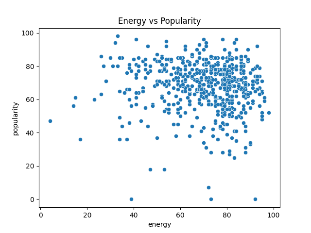
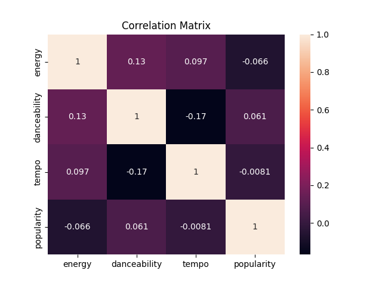

# Introduction

This project analyzes what makes a song popular using Spotify data.

With the rapid growth of digital music platforms, understanding which factors influence song popularity has become increasingly important. This analysis focuses on key musical features such as energy, danceability, and tempo, and examines how they relate to a song’s popularity.

The goal of this project is to identify patterns in the data and build a simple predictive model using linear regression.

# Theory

We use linear regression to model the relationship between song features and popularity.

Linear regression is a statistical and mathematical method used to describe how a dependent variable changes based on one or more independent variables. In this project, the dependent variable is popularity, while energy, danceability, and tempo are independent variables.

The model can be written as:

$$
Popularity = a + b_1 \cdot Energy + b_2 \cdot Danceability + b_3 \cdot Tempo
$$

Here, $(a)$ is the intercept (constant term), and coefficients $(b_1)$, $(b_2)$, and $(b_3)$ represent how much the popularity changes when the corresponding feature increases by one unit, assuming other variables remain constant.

The goal of linear regression is to find the best-fitting line (or hyperplane in higher dimensions) that minimizes the difference between predicted and actual values.

This difference is usually measured using the Mean Squared Error (MSE), which calculates the average of squared differences between predicted and real values.

The error function is:

$$
MSE = \frac{1}{n} \sum (y - y_{pred})^2
$$

The model is trained using the least squares method, which finds coefficients that minimize the total squared error.

This ensures that the model provides the best possible approximation of the data.

Linear regression also allows us to interpret the importance of each feature. Larger coefficients indicate a stronger influence on the target variable.

However, this method has limitations. It assumes a linear relationship between variables and may not capture more complex patterns in the data.

Despite this, it remains a simple and effective tool for initial analysis and modeling.

# Data

The dataset contains song features such as energy, danceability, tempo, and popularity.

Energy describes the intensity and activity of a track. Danceability indicates how suitable a track is for dancing, based on rhythm and tempo.

Tempo represents the speed of a song, measured in beats per minute (BPM).

Popularity is a numerical value representing how well a track is received by listeners.

The dataset was cleaned by selecting only relevant columns and renaming them for simplicity.

# Analysis

## Visualization

These visualizations help us better understand the relationships between variables before applying a mathematical model.

Scatter plots show general trends and allow us to visually estimate correlations between features and popularity.

As shown in @fig-energy, songs with higher energy levels tend to be slightly more popular, although the relationship is not extremely strong.

{#fig-energy fig-align="center"}

As shown in @fig-danceability, danceability has a noticeably stronger relationship with popularity compared to other variables.

{#fig-danceability fig-align="center"}

As shown in @fig-tempo, tempo alone does not strongly determine whether a song becomes popular.

{#fig-tempo fig-align="center"}

The regression model results presented in @fig-predicted demonstrate that predicted values follow the overall trend of actual popularity values.

{#fig-predicted fig-align="center"}

The relationships between all variables can also be observed in @fig-correlation.

{#fig-correlation fig-align="center"}

## Correlation

Correlation values confirm that danceability has the strongest relationship with popularity, while tempo has the weakest.

This means that songs that are easier to dance to are more likely to be popular, while tempo alone is not a strong predictor of success.

The correlation matrix also shows that energy has a moderate positive relationship with popularity, although it is weaker than danceability.

## Linear Regression Model

The regression model estimates how each feature contributes to popularity.

By analyzing the coefficients, we can determine which variables have the greatest impact.

This allows us to move from simple observation (graphs) to a mathematical understanding of the relationships.

Although the model is relatively simple, it still provides useful insights into the structure of the data.

```{python}
#| echo: true
#| output: true

import pandas as pd
from sklearn.linear_model import LinearRegression

# Load dataset
df = pd.read_csv('Spotify Dataset.csv')

# Select important columns
df = df[["Energy", "Danceability", "Bpm", "Popularity"]]

# Rename columns
df.columns = ["energy", "danceability", "tempo", "popularity"]

# Define independent and dependent variables
X = df[["energy", "danceability", "tempo"]]
y = df["popularity"]

# Create and train linear regression model
model = LinearRegression()
model.fit(X, y)

# Display coefficients
print("Coefficients:")
print(model.coef_)

# Display intercept
print("Intercept:")
print(model.intercept_)
```

The output displays regression coefficients and the intercept value.

- The coefficients show how strongly each feature affects popularity.
- Positive values indicate a positive relationship with popularity.
- Larger coefficients represent stronger influence on the predicted result.

The regression model demonstrates that danceability has the strongest influence on popularity, while tempo contributes the least.

## Conclusion

This project analyzed how song features affect popularity.

The results show that danceability has the strongest impact on popularity, while tempo has little influence.

Energy also plays a role, but its effect is moderate.

The model provides a reasonable approximation, but popularity also depends on many external factors such as marketing, artist popularity, trends, and social media influence.

Linear regression helped model these relationships and understand which features matter most.

This demonstrates how data analysis and mathematical modeling can be used to extract meaningful insights from real-world data.

# Resources

The following resources were used during the creation of this project:

- [Spotify Dataset (2010–2019)](https://github.com/Demibolt007/Spotify-Streaming-Insights-2010-2019/blob/main/Spotify%20Dataset.csv)  
  Used as the main dataset for analyzing relationships between song features and popularity.

- [Scikit-learn Documentation](https://scikit-learn.org/stable/)  
  Used for implementing the linear regression model and understanding machine learning functions.

- [Spotify Streaming Insights Repository](https://github.com/Demibolt007/Spotify-Streaming-Insights-2010-2019)  
  Used as an additional reference for understanding the dataset structure and project context.