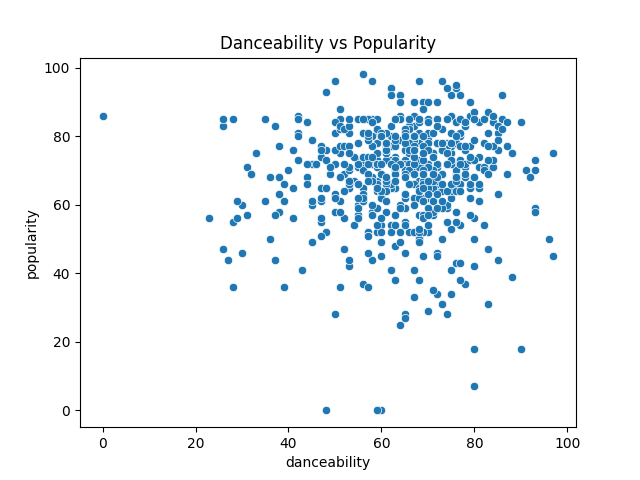
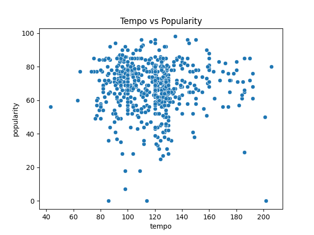
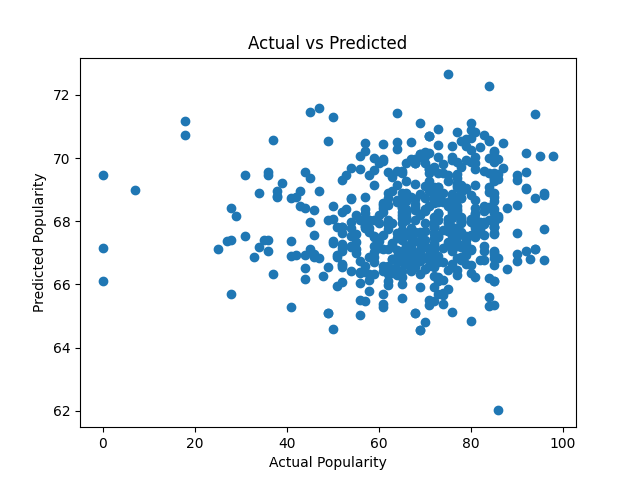

# Spotify Song Popularity Analysis

:::: {.columns}

::: {.column width="35%"}

## Project Overview

This project analyzes how musical features influence song popularity on Spotify using:

- Data visualization
- Correlation analysis
- Linear regression

### Variables

- Energy
- Danceability
- Tempo
- Popularity

## Linear Regression Model

$$
Popularity = a + b_1 \cdot Energy + 
$$

$$
+ b_2 \cdot Danceability + b_3 \cdot Tempo
$$

### Key Findings

- Danceability has the strongest influence
- Energy has moderate impact
- Tempo contributes the least

:::

::: {.column width="65%"}

## Correlation Matrix

The matrix demonstrates relationships between all analyzed variables.

Danceability has the strongest correlation with popularity, while tempo has the weakest relationship.

:::

::::

 

:::: {.columns}

::: {.column width="33%"}

## Energy vs Popularity

Songs with higher energy levels tend to be slightly more popular.

:::

::: {.column width="33%"}

## Danceability vs Popularity

Danceability demonstrates the strongest positive relationship with popularity.

:::

::: {.column width="33%"}

## Tempo vs Popularity

Tempo alone is not a strong predictor of popularity.

:::

::::

 

:::: {.columns}

::: {.column width="100%"}

## Actual vs Predicted Values

The regression model captures general popularity trends reasonably well, although external factors still influence prediction accuracy.

:::

::::

 

## Conclusion

The analysis demonstrates that musical characteristics can partially explain song popularity.

Among all analyzed variables:

- Danceability is the strongest predictor
- Energy has moderate influence
- Tempo has minimal impact

This project also demonstrates how machine learning and data analysis can be applied to real-world music datasets.

